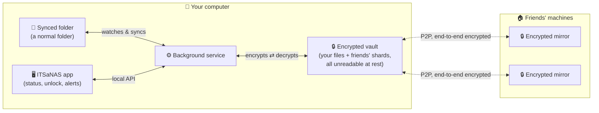
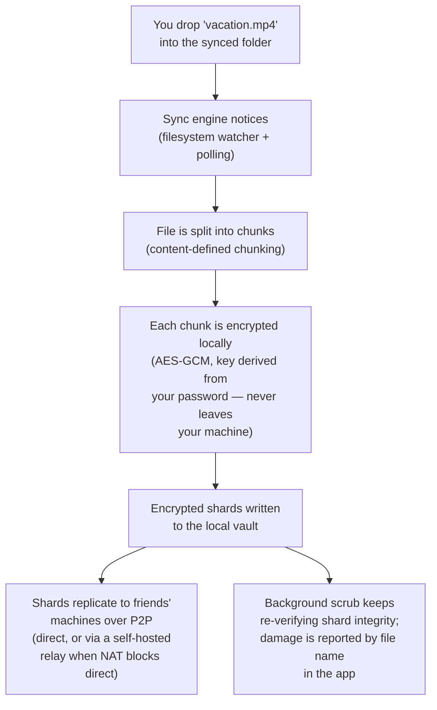
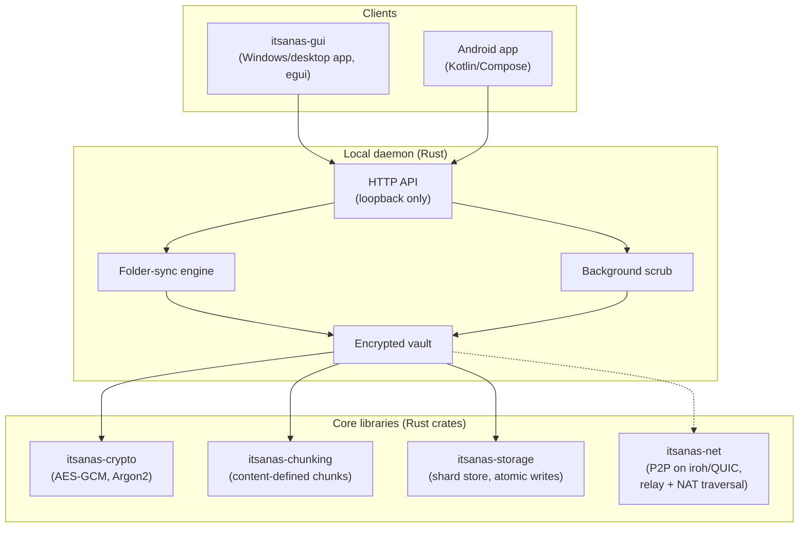
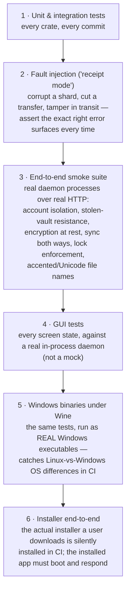

# ITSaNAS at a glance

A visual tour of what this project is, how it works, and how it's
tested — written for any reader, technical or not. Every diagram below
renders directly on GitHub; no tooling needed.

**One sentence**: ITSaNAS turns a group of friends' spare disk space
into a private, encrypted, self-hosted alternative to Dropbox — your
files sync through an ordinary folder on your computer, get encrypted
locally, and are mirrored to machines you actually trust, with no cloud
provider involved.

---

## What a user sees

You install one app. You get one folder. Anything you put in it is
encrypted and backed up to your friends' machines automatically; their
files land on yours the same way, unreadable to you.

Key promises, each one enforced by an automated test (see the testing
section below — none of these is just a claim):

| Promise | What it means concretely |
|---|---|
| **Local-first** | Your files live on your machine; the network adds off-site redundancy and multi-device access, it is not "the storage" |
| **End-to-end encrypted** | File *contents and names* are encrypted before anything leaves your machine — a friend hosting your data can't read a single byte or even see what your files are called |
| **Password-bound** | A stolen copy of the entire data directory is useless without your password |
| **Self-healing visibility** | Corrupted or un-syncable files are detected in the background and shown in the app — problems are never silent |

## How a file actually travels

The same pipeline runs in reverse to read a file back, and the sync
engine also mirrors deletions and edits in both directions — the folder
behaves like any normal folder; the cryptography is invisible.

## The parts, for the technically curious

---

## How it's tested — the part worth a recruiter's attention

The testing philosophy in one line: **every layer is tested where it
actually runs, against real processes and real binaries — and every
production bug becomes a permanent test layer that would have caught
it.**

Layers 5 and 6 exist because of a real event, and it's the best story
in the repo: the very first install on a real Windows machine could
not store a single byte — every write failed with "Access denied".
Root cause: a one-line filesystem-semantics difference between Linux
and Windows (Windows refuses to flush a file opened read-only; Linux
allows it), invisible to any amount of Linux-side testing. The fix took
minutes. The lasting response was structural:

- The full test suite now also runs as **real Windows binaries** (via
  Wine) on every commit — the buggy code fails 9 of 12 storage tests
  under that layer; the fixed code passes 12/12, proving the layer
  genuinely catches this class of bug.
- The **actual installer** is installed and booted in CI on every
  commit — not just built.
- [`TESTING.md`](../TESTING.md) keeps a **"Known blind spots"
  register**: every place the shipped software runs where no automated
  test executes it is either covered or explicitly written down, and an
  entry may only be removed by adding the test — never by deleting the
  bullet.

| CI runs on every commit | What it proves |
|---|---|
| `fmt` + `clippy` + build + workspace tests | The code is clean and every crate's logic holds |
| Fault-injection receipt | Failures produce the *right* errors, never silent corruption |
| Smoke e2e (Linux) | The real daemon does what the promises table above says |
| Smoke e2e (Windows binary under Wine) | …and the *Windows* build does too |
| Installer e2e (Wine) | The exact artifact users download installs and runs |

## Where to go next

- [`README.md`](../README.md) — what the project is, installing
- [`ARCHITECTURE.md`](../ARCHITECTURE.md) — design decisions (D1–D13) and why
- [`TESTING.md`](../TESTING.md) — the full testing doctrine, layer by layer, including the blind-spots register
- [`STATUS.md`](../STATUS.md) — milestone-by-milestone history, including honest write-ups of every production bug found and what was built in response
